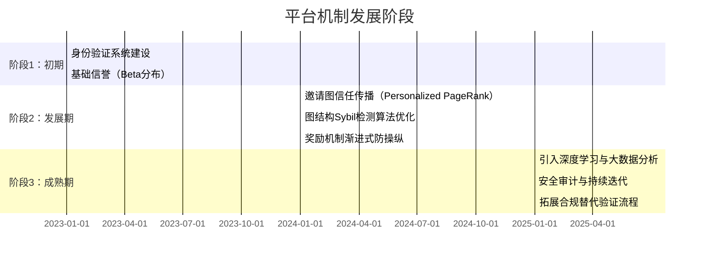
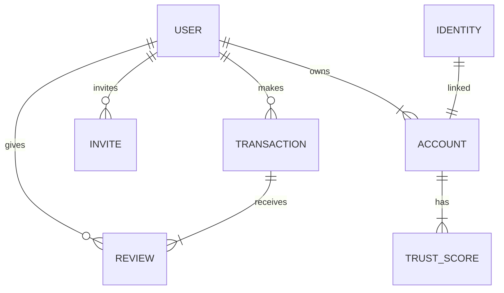

# 执行摘要

设计一个多层次的用户可信度评估与 Sybil 防控方案，需要**分离先验身份风险与后验行为信誉**两个维度来综合衡量。本文提出一种分阶段实施的框架：**初期**侧重提高造号成本和简单信誉打分（如手机号/邮箱/实名认证和 Beta 分布信誉）；**发展期**引入社交邀请图上的信任传播和团伙检测（利用信任种子进行 PageRank/EigenTrust 计算，同时监测社交图结构异常）；**成熟期**则全面采用图论方法和激励机制设计防 Sybil（利用图谱割集、最大流等检测小号团伙，同时设计递减奖励、ID验证押金等手段）。最终每个账号得到一个复合信任度：行为信誉度(`BehavioralCredibility`)与 Sybil 风险(`SybilRisk`)相乘。行为信誉度可由交易成功率、评价分布、信息准确率等指标通过 **Beta分布**或 **Truth Discovery** 等方法计算【24†L30-L32】【31†L61-L64】；网络信誉度可通过邀请/交易网络上的 **EigenTrust/PageRank** 等传播算法估计【29†L228-L231】【16†L14-L21】。Sybil 风险则根据身份特征（如认证级别、设备/IP 同质性）、社交图结构（如社群割集稀疏、互评率高）、时序行为等特征，通过机器学习或贝叶斯推断综合评分【50†L11-L19】【43†L48-L56】。方案兼顾**隐私合规**要求：只有在高风险、高价值场景才要求身份证、人脸等验证（并提供替代方式），并严格数据加密与最小化保存（符合《个人信息保护法》和人脸识别安全管理办法）【11†L85-L93】【14†L102-L110】。本文详细列出了各阶段目标、核心指标、公式示例、阈值设计、触发条件及系统开销，并通过表格和示意图比较各方法优劣，给出具体的信任度计算公式和 Sybil 团伙判定规则，最后附上实施路线图和参考阅读清单。

# 分阶段实施计划

## 阶段 1：初期（森林状社交网络）

**目标：** 平台刚启动时，用户主要来自邀请树/稀疏社交关系，缺乏全局结构。此时，应首先提高造假成本和基础可信度验证，并实行简单的信誉度计算，避免互刷行为造成大范围影响。

- **KYC/身份验证：** 仅在**发起提现、提现、提供高价值商品**等高风险操作时，才要求用户完成实名认证（姓名+身份证）或手机号码/银行账户验证。此时**不强制人脸验证**，可提供短信、银行小额验证、邀请担保等**非人脸方案**（符合《人脸识别管理办法》要求存在替代方式【14†L126-L133】）。验证结果作为一个二元特征 `Verified_i∈{0,1}`。  
- **账号成熟度：** 新账号评分打折，设定线性或指数上升函数：例如
  \[
    M_i = 1 - e^{-\alpha \cdot \text{age}_i},
  \]
  \[
    \alpha_i = 1 - e^{-\beta \cdot n_i},
  \]
  其中 $\text{age}_i$为账号天数，$n_i$为有效行为次数。这样**注册越新、行为越少**的用户，成熟度较低，初期评价权重被抑制。  
- **行为可信度（BehavioralCredibility）：** 利用 **Beta信誉模型**：统计用户 $i$ 的成功交易数 $s_i$ 和失败/纠纷数 $f_i$，计算平滑后信誉评分：
  \[
    B_i = \frac{s_i + 1}{s_i + f_i + 2}\in(0,1).
  \]
 （同理可对好评/差评、满足条件交易/超时等事件分别累加）【24†L30-L32】。Beta 分布计算保证新号不会因少量正评就取高分，也便于持续更新。**此时不考虑社交网络传播，仅根据直接交易表现。**  
- **初级网络信誉：** 在邀请关系图上，将通过了实名认证的“可信种子”设为信任源（$\vec p$），对邀请/交易图做**Personalized PageRank/EigenTrust**：以每个用户累计的评价$ s_{ji}$为边权，迭代公式为
  \[
    N_i = (1-\gamma)\sum_j N_j \frac{\max(s_{ji},0)}{\sum_k \max(s_{jk},0)} + \gamma p_i,
  \]
  其中 $p_i=1/|S|$ 对种子用户、否则 $0$。迭代至收敛得到全局网络信任向量 $\vec N$【29†L228-L231】【16†L14-L21】。种子推广能将有限的真实信任分散到整个邀请树，但在初期社交结构极稀疏时，传播幅度有限。用户的初级网络信誉即$N_i$。种子少时可简单将 $N_i$ 当作 SybilRisk 的补充指标：若与任何种子无连边，则 $N_i$接近0，高度可疑。  
- **Sybil 风险（SybilRisk）预估：** 初期图结构简单，可以使用基于特征的概率模型。典型特征包括：是否实名认证 ($Verified_i$)；邀请人数／邀请链深度；同一手机号/身份证共用账号数量；局部聚类系数；人均好友度等。可用逻辑回归或朴素贝叶斯组合：例如
  \[
    \text{logit}(P(\text{Sybil}=1|\text{features})) = \theta_0 + \theta_1\cdot(1-Verified_i)+ \theta_2\cdot(\text{inviteDepth}_i) + \cdots,
  \]
  并用 sigmoid 转换得到 $0\text{到}1$的 SybilRisk。初期可高设阈值：如 $SybilRisk>0.8$ 视为高危，禁止高价值活动；$>0.5$限制投票/奖励资格。

**数据需求与复杂度：** 初期特征少，仅需处理基本账号资料和少量交易数据，计算量小。投资重点在身份验证接口和简单的信誉计算逻辑。持续收集图数据以准备第二阶段。

## 阶段 2：发展期（社交结构稠密增长）

**目标：** 随着用户增长，社交网络开始形成更多环路与交叉，基础信誉机制和初级防御仍在，但需引入图算法检测小号团伙、完善信誉传播，并制定诱骗奖励机制时充分防范 Sybil。

- **信任传播与网络信誉：** 扩展第二阶段初级PageRank模型，引入用户间评价的加权传播。此时可同时考虑交易评价、邀请推荐、用户信任标记等多种**局部评价(sij)**。对归一化信任矩阵$\mathbf C$计算如 **EigenTrust** 所示的主特征向量【29†L228-L231】：
  \[
    \mathbf t = (1-\alpha)\mathbf C^T \mathbf t + \alpha \mathbf p,\quad \mathbf C_{ij} = \frac{\max(s_{ij},0)}{\sum_k \max(s_{ik},0)}.
  \]
  迭代至收敛后得到全局信任向量$\mathbf t$。此时用户 $i$ 的网络可信度取$t_i$，可作为 BehavioralCredibility 的一部分或辅助 SybilRisk：高被多个低信誉者推崇的节点$t_i$也会较低，防止小号群体互刷产生虚高。  
- **行为信誉增强：** 在 Beta 模型基础上加入时间衰减、事件权重和多源反馈。例如对正负反馈进行指数加权：$s_i=\sum_k e^{-\lambda (T-T_k)}$，$f_i=\sum_j e^{-\lambda (T-T_j)}$，动态追踪近期变化；或者引入对咨询/举报等特定行为加分/减分。另可利用 **真相发现（Truth Discovery）** 方法：当用户提供答案、报告信息或质量评价时，系统并行估计“真实值”和用户可靠度【31†L61-L64】【31†L73-L77】。即：统计用户 $i$ 对客观问题 $o$ 的回答 $\{x_{io}\}$，不断迭代更新其信息可信度 $I_i$：
  \[
    \hat{x}_o=\frac{\sum_{i}I_i \cdot x_{io}}{\sum_{i}I_i},\quad I_i\propto \exp\Big(-\gamma \sum_o (x_{io}-\hat{x}_o)^2\Big).
  \]
  这样经常提供与最终“真相”偏离数据的用户信誉被调低。**阶段2增加信息可信度** $I_i$，与行为可信度 $B_i$ 一起构成行为绩效分。  
- **图结构检测规则：** 随社交图增密，可用基于图论的 Sybil 检测。检测候选团伙 $S$ 的常用指标：
  - **导出割集(Conductance)：** $\phi(S)=\frac{|E(S,V\setminus S)|}{\min(\mathrm{vol}(S),\mathrm{vol}(V\setminus S))}$. 若 $S$ 内部边密集、与外部连边稀少，则 $\phi(S)$ 很低。实际可对类似于邀请圈子或活跃互评圈做社区发现（如Louvain算法），计算群组导出率。若 $\phi(S)<\tau_\phi$（如 $0.05$~$0.1$），则标记该群体可疑【43†L48-L56】【45†L303-L311】。  
  - **互评率(Reciprocity)：** 统计群组 $S$ 内双向互相评价次数，与总评价次数之比。如 $Rec(S)=\frac{\#\{u,v\in S: u\to v\text{且}v\to u\}}{|E(S)|}$。如果互评率过高（接近 1），说明群组内成员互刷严重，需降权处理。  
  - **新邻居比例(New-Neighbor Ratio)：** 对每用户 $i$，设其邻居中新注册用户占比，$NNR_i=\frac{\#\{\text{最近注册邻居}\}}{\#\{\text{所有邻居}\}}$。如果 $NNR_i>\tau_{nnr}$（如 0.8），并且这些新邻居彼此高度相关，则怀疑是主账号培养小号。  
  - **账号相似度(Avg-Sim)：** 计算一组账号在设备指纹、IP、行为模式、评价内容的**相似度**（取0~1）。若某群组内账号彼此相似度极高（比如 $>0.9$），说明可能同人操作。可定义 $Sim(i,j)$ 评分，取群组内平均。阈值 $>0.85$ 或更高时应加大审查。  
  - **种子流(max-flow)：** 从可信种子到节点 $i$ 计算最大流（假设边容量为信任权重）。如果最大流接近 0，说明该节点与任何种子几乎无信任连接，也是高 Sybil 风险。将 **种子流量** $F_i=\maxflow(\{\text{seeds}\}\to i)$ 作为负面因素：$F_i$ 越低，$i$ 风险越高。  
  这些指标可组合成 SybilRisk 模型：如使用逻辑回归或神经网络：
  \[
    \mathrm{logit}(SybilRisk_i)=\alpha_0 + \alpha_1\phi(S_i) + \alpha_2 Rec(S_i)+\alpha_3 NNR_i + \alpha_4 (1-F_i) + \alpha_5 AvgSim(S_i)+\cdots.
  \]
  同时应考虑**误报抑制**：只针对较大疑似社区应用强措施，小群体内互评不一定就是恶意（可能真实朋友）。需设置阈值组合，如：“$\phi<0.05$ 且 $Rec>0.8$”才标记团伙危险。  
- **可疑子图应对策略：**  
  - **降权机制：** 发现互刷圈后，对圈内评价赋低权或视为无效；对于证据不足但风险高的用户，可限制其**评价权重**：乘以 $(1-SybilRisk_i)$。  
  - **同源贡献封顶：** 对来自同一邀请链或设备组的评价设置上限。例如：$\sum_{j\in group}Trust_j\cdot r_{ji}\le C_{group}$；新号之间互相打分不会线性叠加。  
  - **人工审核和押金：** 对于高度可疑交易或高额活动（如提现、竞拍）设置**押金**或**担保**，并提升人工风控。对于 $SybilRisk>0.8$ 的账号，必须二次验证身份或交纳担保金方可进行高价值操作；若违规则扣除押金。  
  - **邀请链限制：** 设定邀请奖励**衰减**或封顶：例如链上第 $k$ 层获得奖励 $R\delta^{k-1}$ ($0<\delta<1$) 并总和不超过上限。这样打破“造长链”攫取奖励的激励，只有前几级邀请人能拿到显著回报。  
- **奖励/传播机制防操纵：** 若平台有邀请传播、问答奖励等功能，必须应用 Sybil-免疫机制：只奖励关键贡献节点，限制链式套利。例如仅奖励【50†L11-L19】：  
  - 问答类只奖励**回答者**和直接邀请人（若有）；  
  - 传播奖励按**最短路径**分配，不奖励中间虚拟节点；  
  - **总奖励封顶**，避免奖励随链长线性增。  
  这些机制有助阻断 Chen 等人在“Query Incentive”模型中指出的伪造回答链问题。  

**数据需求与复杂度：** 增加了社交图分析，需维持全图或社区图的度量（节点数千万时建议采用近似算法，如 LPA 社区发现、随机游走抽样）。PageRank/EigenTrust 迭代复杂度 $O(E)$，图割/流算法相对昂贵，可离线周期性执行或针对怀疑子图局部运算。特征计算和模型推断可批处理实现，总体可扩展性取决于图大小，需考虑分布式存储和计算（如Spark GraphX、GraphLab 等）。

## 阶段 3：成熟期（稠密稳定网络）

**目标：** 平台进入成熟运营，社交图已高度混合且节点众多，Sybil 攻击手段进化（如更真实的身份冒充、机器人模拟行为）。阶段3重点完善和精细化可信度评估：使用高级机器学习与图算法融合，多层次防御策略。

- **综合可信度计算：** 保持核心公式
  \[
    \text{FinalTrust}_i = (1 - SybilRisk_i)\bigl(w_B B_i + w_I I_i + w_N N_i + w_A A_i\bigr),
  \]
  其中 $B_i$ 行为信誉、$I_i$ 信息信誉、$N_i$ 网络信誉、$A_i$ 成熟度。权重 $w_*$ 通过 A/B 测试和历史优化确定（如初期可 $w_B=w_I=w_N=0.3,w_A=0.1$）。$SybilRisk_i$ 独立计算后乘以(1-风险)为惩罚因子。**样例参数：** 可设阈值 $SybilRisk_i>0.8$ 将 FinalTrust 减到接近0；$w_A$ 可以随平台成熟逐渐降低（账号年龄成为弱特征）。各子项实例公式如下：  
  - **行为信誉** $B_i$：可基于 Beta 计算正负反馈比率，或归一化交易成功率。高级版本可用评价分分布：设平均评分 $\mu_i$ 和方差 $\sigma_i^2$，取 $B_i=\frac{\mu_i}{5}\cdot e^{-\kappa\sigma_i}$，高评分且评分稳定的用户分更高。  
  - **信息信誉** $I_i$：如前述真相发现方法，或基于“标记可信用户说过的话为真”。可取 $I_i=e^{-\gamma \cdot \text{Err}_i}$，其中 $\text{Err}_i$ 是用户回答与最终结果的偏差均值【31†L61-L64】【31†L73-L77】。  
  - **网络信誉** $N_i$：阶段2的 PageRank/EigenTrust 结果，或加社交信任权重。当平台逐步出现多维交互（评论、点赞、转发），可构造异构图并用 Personalized PageRank 扩展。  
  - **账号成熟度** $A_i$：可简单设为账户活跃天数的 Sigmoid 函数：$A_i=\tanh(\alpha\cdot \text{age}_i)$. 老号信誉更有承诺，但仅此不足以抵消高 SybilRisk。  
- **Sybil 风险细化：** 随用户行为数据丰富，可训练更精细模型。引入**时序图神经网络**或*Graph Convolutional Networks*等，自动学习小号子图特征。依旧采用上述图结构统计（导出割、互评、相似度、seed-flow）作为输入，同时增加“设备/IP切换频率”“行为偏离指标”（突然大量点赞、评分分布极端）等新特征。通过深度模型输出概率$SybilRisk_i$【50†L11-L19】。  
- **高级检测与响应：** 
  - **连边熔断**：对检测到可疑社群，切断其社交/邀边的信任贡献。  
  - **可疑圈封禁**：对于**多次被标记的高 SybilRisk 社群**（如连续三次触发导出割低阈值），**临时冻结**其内部奖励发放，要求完成更严格验证（如人脸+KYC）。  
  - **持续审计**：引入**在线学习**，随攻防演变不断更新特征和阈值。定期利用混淆矩阵评估检测效果，对正负样本再标注，提升模型精度。  
- **可行性与复杂度：** 成熟期投入重于前期，要求大规模社交图分析能力。构建大规模 GNN 可能成本高，可先用经典图划分+机器学习混合解决。奖励机制可持续演化，但要定期审计 Sybil 攻击新策略，迭代安全规则。**替代验证流程：** 对高风用户提供**非人脸**认证选项，例如银行双签、朋友担保、实名借贷历史验证等，满足《办法》“存在其他非人脸方式”的要求【14†L124-L132】。敏感数据（身份证号、照片、人脸模板）不留存，仅保存验证结果。



# 评估指标与公式

## 1. 行为可信度（BehavioralCredibility）

基于用户历史交易行为的可靠度评估，可拆为数个指标综合。例如：

- **交易成功率**：$SR_i=\frac{s_i}{s_i+f_i}$，以 Beta 模型平滑后得信誉分
  \[
    B_i = \frac{s_i+1}{s_i+f_i+2} \in (0,1).
  \]
- **评价分布**：设用户平均评分$\mu_i$（范围0~1）和标准差$\sigma_i$，可定义稳定好评度
  \[
    B_i'=\mu_i\cdot e^{-\kappa\sigma_i},\quad \kappa>0.
  \]
- **纠纷率**：因银行退款/交易取消的事件，按一定惩罚值$F_i=1/(1+e^{-\lambda (s_i-f_i)})$等方式降低。  
- **回答准确度（信息层）**：若用户提交信息或解答，使用真相发现，根据信息误差调整：如
  \[
    I_i = \exp\bigl(-\gamma\sum_{o}(x_{io}-\hat x_o)^2\bigr), 
  \]
  $\hat x_o$ 为经汇总估计的真值【31†L61-L64】【31†L73-L77】。$I_i$ 越高表示提供真实信息的能力越强。  
- **行为稳定性**：监测交易/登录间隔，一致性低（CV高）的账号$A_i=1/(1+\text{CV})$得分低。  
- **综合行为分**：可以简单加权融合上述，比如
  \[
    B_i = w_{SR}B_i + w_{\mu}B_i' + w_I I_i + w_A A_i,
  \]
  调整权重得到单一后验信誉分。

## 2. 信息可信度

信息可信度（如果平台存在用户上报事实/审核等功能）可单独建模。应用 Truth Discovery 思路同时解答源准确度与事实真相。若用户 $i$ 针对对象 $o$ 提供了值 $x_{io}$，则迭代：
\[
\hat{x}_o = \frac{\sum_i I_i \, x_{io}}{\sum_i I_i}, 
\quad
\text{Err}_i = \frac{1}{|\mathcal{O}_i|}\sum_{o\in\mathcal{O}_i}d(x_{io},\hat{x}_o),
\quad
I_i = e^{-\gamma \, \text{Err}_i}.
\]
其中 $d(\cdot,\cdot)$ 是数值差或分类一致指示函数【31†L61-L64】【31†L73-L77】。这样常给出准确信息的用户 $I_i$ 趋近 1，否则趋近 0。

## 3. 网络可信度（Network Trust）

以**邀请图或交易图**为基础，将平台中公认的高信任账号设为“种子”。采用 Personalized PageRank/EigenTrust 算法【29†L228-L231】：
\[
N_i = (1-a)\sum_{j}N_j\,c_{ji} + a\,p_i,
\quad
c_{ji} = \frac{\max(s_{ji},0)}{\sum_k\max(s_{jk},0)},
\]
其中 $s_{ji}$ 是用户 $j$ 给 $i$ 的满意度（或成功交易数），$\vec p$ 在种子节点均匀分配、其他为0。迭代得收敛信任向量 $\vec N$。$N_i$ 值高意味着该用户被可信用户公认。种子可由平台事先筛选（如实名认证完备且无投诉的用户）。**此算法自动放大可信用户评价的作用**，抑制小号互刷【29†L228-L231】【16†L14-L21】。

## 4. 账号成熟度（Maturity）

定义为账号年龄和活跃度的函数，用于克服冷启动偏差。例如设账号存在天数 $t_i$、历史有效交易 $h_i$：
\[
A_i = (1 - e^{-\alpha t_i}) \cdot (1 - e^{-\beta h_i}),
\]
其中常取 $\alpha,\beta\approx 0.01$，使得新账号和低活跃账号 $A_i\approx 0$，老账号渐近于1，但不可超越。成熟度可作为 FinalTrust 的次要加成因子。

## 5. Sybil 风险 (SybilRisk)

将各种身份和图结构可疑特征综合为概率值。典型计算模型为：

\[
SybilRisk_i = \sigma\bigl(\theta_0 + \theta_1 \phi(S_i) + \theta_2 Rec(S_i) + \theta_3 NNR_i + \theta_4 (1-F_i) + \theta_5 AvgSim(S_i) + \theta_6 Verified_i + \ldots\bigr),
\]

- $\phi(S_i)$：节点 $i$ 所在社区（或链）与外部边的导出割率【45†L303-L311】。低导出率提示 Sybil 团体。  
- $Rec(S_i)$：所在圈子互评率，如互相点赞/打分的回头率。  
- $NNR_i$：新邻居比（新号比例）。  
- $F_i$：从种子到 $i$ 的最大流占比（Normalized seed-flow）。若 $F_i$ 很小，说明与可信区块几乎隔离。  
- $AvgSim(S_i)$：所在群组账号特征相似度均值（设备、行为、文本）。  
- $Verified_i$：是否通过实名认证（0/1）。  
- 其他：设备/IP 重合度、收货地址重复度、密码重用等**（隐私合规下慎用）**。  

权重 $\theta_j$ 可通过历史数据训练确定。输出用 sigmoid 函数映射为 [0,1]。**高 SybilRisk**（如$>0.8$）标示小号或团伙攻击，系统对其施加严格限制；$0.3$ 以下视为低风险。

## 6. 最终信任度（FinalTrust）

将以上评分组合：
\[
FinalTrust_i = (1 - SybilRisk_i)\,\bigl(w_B B_i + w_I I_i + w_N N_i + w_A A_i\bigr),
\]
其中 $B_i,I_i,N_i,A_i\in[0,1]$ 如上所定义。示例参数可取 $w_B=w_I=w_N=0.3, w_A=0.1$，再根据平台重点调整。例如注重交易表现则提高 $w_B$，注重信息真伪则提高 $w_I$。*SybilRisk*作用如惩罚系数：风险高会显著降低最终分值。这样保证仅**行为表现好且身份可靠**的用户才能获得高信任度。

# 图检测规则与异常子图处理

### 导出率（Conductance）

对社交/邀请图上任一节点集合 $S$，定义其导出率：
\[
\phi(S)=\frac{|E(S,V\setminus S)|}{\min(\mathrm{vol}(S),\mathrm{vol}(V\setminus S))}.
\]
如果一个社区内部连接密集、与外部连接很少（$\phi\to0$），则可能是 Sybil 群体或小号圈套。可用图算法（如 Louvain 社区发现）找出可能的候选群组 $S$，若 $\phi(S)<0.05$（经验阈值可调）且群组内互评密度高，就标记为**可疑团伙**【45†L303-L311】【50†L11-L18】。应对策略：该群组内用户互相评价降权或视为无效。

### 互评率（Reciprocity）

定义群组 $S$ 的互评率为内部双向边比例：
\[
Rec(S) = \frac{\#\{u,v\in S: u\to v\text{ 且 } v\to u\}}{|E(S)|}.
\]
若 $Rec(S)$ 过高（例如 $>0.8$），说明成员之间大量互刷。平台可对互评行为采用衰减机制，如只计一次互评或降低权重。同时检测个体：连续三次被同一用户互评的用户，其个别信誉权重也可以适度降低。

### 新邻居比例（New-Neighbor Ratio）

对每节点 $i$，计算其近期新增邻居（如一个月内注册且与其建立关系的用户）占所有邻居的比例：
\[
NNR_i = \frac{\#\{\text{新邻居}\}}{\#\{\text{总邻居}\}}.
\]
高 $NNR_i$ 意味着用户可能在短时间内吸纳了大量新账号。若 $NNR_i > 0.8$ 且这些新邻居彼此相关度高，说明可能是“主号养小号”。可暂时降低 $i$ 从新邻居处获得的信誉输入，或核验新邻居真实身份。

### 相似度（Avg-Sim）

计算一组账号 $S$ 的**平均特征相似度**：如设备/IP/token 重合度、评价文本相似度等。令 $Sim(i,j)\in[0,1]$ 为账号 $i,j$ 的相似度，群组相似度
\[
AvgSim(S)=\frac{1}{|S|(|S|-1)}\sum_{i\neq j\in S} Sim(i,j).
\]
若 $AvgSim(S)>0.9$，说明几乎复制账号。此时将 $S$ 全体标记高风险，可考虑冻结或加强验证。对个体判断时，可与其高相似账号组平均相似度比较。

### 种子最大流（Seed-Flow）

设可信种子集合为 $P$。将邀请/交易图边赋权为互评信任强度，计算从 $P$ 到用户 $i$ 的最大流值 $Flow(i) = \maxflow(P\to i)$。若 $Flow(i)$ 非常小（如接近0），表示 $i$ 几乎与任何种子无连通路径，是孤立的高风险账号。可设置门槛：$Flow(i)<\tau_F$（比如网络中位数的10%）的用户显著提高 SybilRisk。

### 可疑子图判定阈值及策略

- 若检测到社区 $S$ 满足**“导出率$\phi(S)<0.05$ 且 互评率$Rec(S)>0.7$”**，则视为严重可疑团体：对 $S$ 内所有评价去重或降权，群内交易置审核流程，群成员触发二次验证。  
- 若单个用户 $i$ 符合**“高风险特征组合”**（例如 $NNR_i>0.9$、$AvgSim$ 与其邀请链新注册者群体$>0.9$、且$Flow(i)<\tau_F$），则降低其 final trust（乘以 $(1-SybilRisk_i)$）、限制其功能（如设定交易/提现上限、禁止作为担保人）。  
- 对持续违规或逃避机制的账户，可以**强制人脸+KYC验证**，甚至冻结账户；并对同一身份证/设备下所有账户联动处理。  
- **押金机制**：对高风险账号参与的高价值交易，要求预交保证金，违约或发现合谋时扣除。该机制**增加Sybil成本**，降低攻击收益。

# 奖励/传播机制防操纵

对平台激励机制（邀请、答题、分享奖励等）需防止小号利用。原则包括【50†L11-L19】【43†L48-L56】：

- **递减奖励**：奖励随路径长度递减，例如第 $k$ 级邀请奖励 $R\delta^{k-1}$ ($0<\delta<1$)，避免制造长链诱导多层级返利。  
- **封顶总额**：设一个最大奖励$R_{max}$，超过后不再增加，打击利用额外节点重复领取。  
- **最短路径/关键节点**：在信息传播、邀请网络中，仅奖励**最短路径上的转发者**或**询问者和第一个回答者**（关键节点），而不奖励无贡献的中间位置。  
- **Sybil-证明机制**：参考 Chen 等人的**Query Incentive Network** 机制设计，确保任意用户构建伪造多级链不能增加奖励。具体实现可依据“消费者-推荐人-回答者”层级只对直接发起者和贡献者付费【50†L11-L19】。  

通过以上设计，能在激励用户参与的同时，切断虚假身份链路所带来的多余收益。

# 方法对比表

以下表格总结了常见信任评估和 Sybil 防御方法的优缺点与适用场景：

| 方法/类别 | 基本思路 | 优点 | 缺点 | 适用场景 |
|---|---|---|---|---|
| **Beta信誉系统**（Jøsang 2002）【24†L30-L32】 | 用 β 分布融合成功/失败反馈；输出平滑概率 | 理论严密，新用户平滑分；计算简单 | 仅统计正负反馈，不考虑评价者身份；易受群体刷单影响 | 交易评价稀疏平台的信誉计算基础 |
| **EigenTrust/PageRank**（Kamvar 2003）【29†L228-L231】 | 将用户互评/交易图的正规化信任值迭代聚合，得全局信任向量 | 利用信任传播，高信誉者评价更重；收敛后节点评分 | 需构建全图，规模大时计算压力大；依赖网络混合性假设 | 社交/交易网络连通度提高后，做全局信誉排名 |
| **Truth Discovery**（Li 2016）【31†L61-L64】 | 同时估计事实真相和用户可靠度，迭代调整 | 能识别信息冲突场景；更客观地评价用户“说真话”的能力 | 需要同一对象多源数据；模型复杂度高 | 信息汇聚、问答、众包平台中用户提供内容可信度 |
| **特征+ML模型** | 利用账号特征（行为、社交、设备等）训练分类器 | 弥补单一评分体系限制；可检测复杂行为模式 | 需要标注数据；模型解释性差；易过拟合 | 需大量历史数据平台，如综合电商或社交平台的风控系统 |
| **KYC/实名认证** | 强制用户实名认证或人脸核验 | 提高造假成本，一人难注册多个；合法合规身份保障 | 隐私敏感，用户体验差；不能防止掉包/代检；如 Douceur 指出无“中心化认证”则始终有漏洞【41†L19-L22】 | 高价值业务（金融、信贷、出借）或需“一人一票”场景 |
| **资源测试（PoW/PoS）** | 要求用户提交算力证明、支付费用或可验证身份 | 可以用经济成本限制 Sybil（如POW算力） | 攻击者可租资源突破；正当用户成本增加 | 区块链或匿名环境的节奏控制（但通常中心化场景不适用） |
| **社交图防御**（SybilGuard/Limit）【45†L293-L300】 | 利用真实社交图：随机游走难穿越 Sybil- honest 边 | 不需要中心认证；理论上可应对大量 Sybil | 假设社交网快速混合，现实中验证困难；随机性，容忍误判 | 社交媒体、P2P网络初步Sybil检测；需真实信任网络基础 |
| **贝叶斯图方法**（SybilInfer）【50†L11-L18】 | 构建概率模型估计每节点是 Sybil 的概率 | 输出概率、更灵活；考虑全局信息；效果优于启发式 | 计算复杂度高；需要良好的先验模型 | 需要精确控制 Sybil（如金融风控），数据量中等时使用 |
| **False-name-proof设计**（Yokoo等） | 设计拍卖/激励机制，理论上杜绝假名优势 | 理论完备，机制安全性可证 | 常带效率损失；可能只在特殊机制可行；复杂不易理解 | 专业竞价、拍卖系统的核心设计，如数字广告竞价 |
| **押金/惩罚机制** | 对行为承诺设置经济押金，违约或被判欺诈时扣罚 | 直接提高攻击成本；威慑作用强 | 需要监管流程；可能阻挡良性用户尝试 | 高价值交易、P2P信贷等领域 |

# 示意图与可视化建议

下图示例为综合评估流程，可以用**流程图**表达各步骤的关系：  
```mermaid
flowchart TD
    subgraph 身份层
    A1[账号注册] --> A2{是否实名?}
    A2 -- 否 --> A3[基础验证: 手机/邮箱]
    A2 -- 是 --> A4[身份证+KYC验证]
    A3 --> B1[获得基础IDTrust]
    A4 --> B1
    end
    subgraph 信誉层
    B1 --> C1[记录交易/评价]
    C1 --> C2[计算Beta信誉$B_i$]
    C1 --> C3[构建评价图]
    C3 --> C4[EigenTrust/PageRank计算$N_i$【29†L228-L231】]
    C1 --> C5[真相发现更新$I_i$【31†L61-L64】]
    C2 --> D1[合成BehavioralCredibility]
    C4 --> D1
    C5 --> D1
    end
    subgraph Sybil检测
    A1 --> D2[图算法特征提取]
    D2 --> D3[计算Subgraph Metrics (φ,Rec,NNR,Sim)]
    A4 --> D4[计算身份信息特征]
    D3 --> D5[合成SybilRisk (贝叶斯)]
    D4 --> D5
    end
    D1 & D5 --> E[FinalTrust]
```
此外，可用**实体关系图(ER图)**说明系统中的主要数据实体和关系。例如：  

其中 **USER**、**ACCOUNT**、**IDENTITY**、**TRANSACTION** 等实体现平台业务关系，用于数据库设计。

常用可视化图表包括：  
- **热力图/柱状图**：显示不同 SybilRisk 特征分布，如邮箱验证占比、互评群体大小；  
- **ROC 曲线**：评估最终模型的真阳性率与假阳性率；  
- **折线图/柱状图**：不同阶段**规则调整前后**作弊检测率对比；  
- **社交图可视化**：高风险子图在真实社交图中的嵌入，展示信任区域 vs Sybil团伙边界。  

# 隐私合规要点与数据最小化

- **必要性原则**：仅在必要场景收集敏感信息（如身份证、活体视频）。对于一般功能，应先考虑手机号/邮箱验证【14†L126-L133】。身份验证页面要明确告知用途和影响，并获得用户**单独同意**【14†L102-L110】。  
- **非人脸替代**：遵守人脸管理办法，**不得强制唯一人脸**。如用户拒绝人脸，可提供其他方式（如手机验证、好友担保、视频通话确认等）【14†L124-L132】。  
- **数据最小化**：系统内只保留**验证结果**（如“实名认证通过”标识），而非原始图像或身份证。人脸信息应存储在设备中（如人脸识别终端）而不上传【14†L108-L112】。敏感日志和临时数据须加密存储，并制定自动删除策略（比如人脸扫描数据仅用于当次验证立即删除）【14†L124-L132】。  
- **安全评估**：上线前务必进行个人信息保护影响评估【14†L110-L119】。如使用任何基于人脸/身份证的技术，须至少保存评估报告及处理记录3年【14†L110-L119】。  
- **用户权利**：提供撤回同意机制（如注销账号即删除个人身份数据）【14†L102-L110】。对人工智能决策（如 Sybil 风控）可能产生的风险，应告知用户申诉途径。  

# 实施路线图

1. **搭建身份验证系统**：优先实现手机号/邮箱验证模块和基本的实名认证接口，保护早期交易。  
2. **上线基础信誉算法**：部署 Beta 信誉模型、基础评价收集系统，保证普通交易评价能够即时影响用户分。  
3. **信任种子筛选**：定向邀请或筛查一批可信种子（如内部员工、先期合作商家）用于后续信任传播。  
4. **引入信任传播**：在阶段2启动个人化 PageRank/EigenTrust 模块，结合邀请图与交易评价对用户打分。  
5. **增量引入防 Sybil 规则**：一开始使用简单规则（实名认证检查、设备/IP 抑制），随后实现图算法（社区发现、最大流）检测可疑群体。  
6. **奖励机制升级**：设计邀请和答题奖励方案，加入递减与封顶原则，对新账号延期发放全部奖励。  
7. **持续优化与审计**：定期更新 Sybil 风险模型，引入更多特征（时空行为、内容相似性）。进行漏洞挖掘和用户反馈收集，不断迭代。

# 优先阅读参考论文

- **信任与信誉综述**：Jøsang等, *A Survey of Trust and Reputation Systems*【16†L14-L21】；Sherchan等, *Survey of Trust in Social Networks*【33†L15-L18】。  
- **信誉系统基础**：Jøsang *Beta Reputation System*【24†L30-L32】；Kamvar等 *EigenTrust Algorithm*【29†L228-L231】；Li等 *Truth Discovery Survey*【31†L61-L64】【31†L73-L77】。  
- **Sybil 攻击基础**：Douceur, *The Sybil Attack*【41†L19-L22】；Mohaisen & Kim, *Sybil Attacks and Defenses Survey*【43†L48-L56】。  
- **社交防 Sybil**：Yu等 *SybilGuard*【45†L293-L296】；Yu等 *SybilLimit*；Danezis & Mittal *SybilInfer*【50†L11-L19】。  
- **False-name 机制**：Yokoo等 *False-name bids in Combinatorial Auctions*；Sakurai&Yokoo *GTPD*；Chen等 *Sybil-proof Query Incentives*；Zhang等 *Sybil-proof Answer Mechanism*。  
- **隐私法规**：中华人民共和国《个人信息保护法》；网信办 *《人脸识别技术应用安全管理办法》*【14†L102-L110】【14†L124-L132】；最高检 *“多层次”法律规范保护人脸识别信息*【11†L85-L93】。

以上文献覆盖了信誉评估、Sybil 检测和合规要求的核心理论与实践，可作为实施的知识支持。